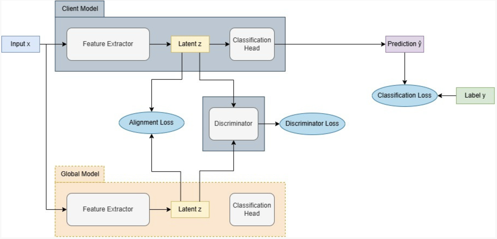

# 🚀 Mitigating Data Heterogeneity in Federated Learning through Latent Space Alignment

  
  
  
  

---

Federated Learning (FL) enables collaborative training across decentralized devices without sharing raw data — preserving privacy in sensitive domains like **healthcare, banking, and mobile applications**.

However, FL faces a critical challenge: **data heterogeneity**. Clients often hold **non-IID (non-identically distributed)** datasets, leading to **client drift**, degraded convergence, and uneven performance.

This project investigates and extends **latent space alignment techniques** to address this challenge. By aligning the **feature representations (latents)** of local and global models, we significantly improve model robustness in heterogeneous FL settings.

---

## 📖 Table of Contents

- [What’s Already Done](#-whats-already-done)
- [Our Proposed Methods](#-our-proposed-methods)
- [Why Our Approach is Better](#-why-our-approach-is-better)
- [Experimental Setup](#-experimental-setup)
- [Results & Key Insights](#-results--key-insights)
- [Future Work](#-future-work)
- [Conclusion](#-conclusion)
- [Repository](#-repository)

---

## ✅ What’s Already Done

### Baselines

- **FedAvg** (McMahan et al., 2017) → standard model averaging, struggles under non-IID data.
- **SCAFFOLD** (Karimireddy et al., 2021) → variance reduction with control variates, reduces drift but does not explicitly align features.

### Existing Alignment Techniques Tested

- **Maximum Mean Discrepancy (MMD)**
- **Kullback–Leibler Divergence (KL-Div)**
- **Wasserstein Distance**
- **Ridge Regularization**

All of these were integrated into the **FedAvg framework**, introducing an **alignment loss** in addition to the traditional classification loss:

\[
L*\text{total} = L*\text{classification} + \lambda L\_\text{alignment}
\]

This ensures local feature spaces remain close to the global model’s representation.

---

## 🚀 Our Proposed Methods

We introduce two **novel alignment techniques** designed for FL:

### 🔹 1. Gradient Harmonization Between Losses (FedGHBL)

- Balances gradients from **classification** and **alignment** losses.
- Detects conflicting gradient directions using cosine similarity.
- Projects out conflicts → ensures updates are **cooperative, not destructive**.
- Strongly reduces client drift while maintaining predictive accuracy.

  
_Figure: Workflow of Gradient Harmonization Between Classification and Alignment Losses._

---

### 🔹 2. Adversarial Feature Alignment (FedAdversarial)

- Inspired by **GANs** (Goodfellow et al., 2014).
- Trains a discriminator to **distinguish local vs global latent distributions**.
- Local models learn to “fool” the discriminator, making their latents **indistinguishable from global latents**.
- Dynamically aligns client representations across rounds.

  
_Figure: Adversarial Feature Matching for aligning local and global latent distributions._

---

### 🔹 Combined Workflow

  
_Figure: Latent Alignment Workflow showing integration of alignment and classification losses._

---

## 💡 Why Our Approach is Better

| Technique             | Accuracy (α=0.5) | Accuracy (α=2.0) |
| --------------------- | ---------------- | ---------------- |
| FedAvg                | 69.47%           | 74.44%           |
| SCAFFOLD              | 72.49%           | 75.07%           |
| FedAvg + KL-Div       | 74.63%           | 75.55%           |
| FedAdversarial (ours) | 75.01%           | 77.50%           |
| **FedGHBL (ours)**    | **76.88%**       | **80.16%**       |

✨ **Highlights:**

- All alignment techniques outperform FedAvg.
- **FedAdversarial** improves over both FedAvg and SCAFFOLD.
- **FedGHBL is the best performer**, achieving **up to +11% accuracy gains** under severe heterogeneity.

  
_Figure: Accuracy trends over communication rounds (α = 0.5). FedGHBL achieves the best performance._

---

## ⚙️ Experimental Setup

- **Dataset:** CIFAR-10 (non-IID partitions via Dirichlet distribution).
- **Clients:** 5 simulated clients with label + quantity skew.
- **Model:** TinyVGG backbone.
- **Training:**
  - Learning rate: `0.001`
  - Batch size: `128`
  - 15 communication rounds
  - 5 local epochs per client per round
- **Evaluation Metrics:**
  - Classification Accuracy
  - KL Divergence (proxy for client drift)

---

## 📊 Results & Key Insights

📌 **Key Observations**

- FedAvg shows high drift → accuracy suffers.
- Adding alignment losses (esp. KL-Div) drastically reduces drift (~500x decrease in KL divergence).
- FedGHBL aligns gradients locally, producing **smoother convergence** and best global accuracy.
- FedAdversarial dynamically reduces domain gaps → consistently strong improvements.

> Alignment not only boosts accuracy but also **reduces representation divergence** between clients and the global model.

### Drift Analysis

  
_Figure: FedAvg – classification loss and KL divergence drift trend._

  
_Figure: SCAFFOLD – classification loss and KL divergence drift trend._

  
_Figure: FedAvg + KL – drift drastically reduced (~500x lower KL divergence)._

---

## 🔬 Future Work

1. **Real-World Validation**

   - Extend experiments to real-world FL datasets (healthcare, finance, mobile).

2. **Efficiency & Scalability**

   - Study **computational & communication overhead** of FedGHBL and FedAdversarial.
   - Optimize for **mobile/IoT constraints**.

3. **Beyond Accuracy**

   - Fairness, robustness to adversarial clients, client dropout handling.
   - Explore **privacy-preserving combinations** with Differential Privacy.

4. **Extended Alignment Strategies**
   - Align **logits** in addition to latents.
   - Hybrid methods: combine gradient correction (e.g., SCAFFOLD) with latent alignment.
   - Dynamic client selection based on alignment needs.

---

## 🏁 Conclusion

This work demonstrates that **latent space alignment** is a powerful approach to address data heterogeneity in Federated Learning.

- Existing methods (KL, MMD, Wasserstein, Ridge) improve performance moderately.
- Our novel approaches, **FedGHBL** and **FedAdversarial**, provide **state-of-the-art improvements** under non-IID settings.
- This research opens pathways for **robust, scalable, and privacy-preserving FL systems**.

---

## 📂 Repository

🔗 [Latent-Alignment-in-FL (GitHub)](https://github.com/MSafiullah1/Latent-Alignment-in-FL.git)

---
